# Instagram Clone

A full-stack Instagram clone built with modern web technologies, featuring real-time messaging, stories, posts, and social interactions.


## 📸 Screenshots

<div align="center">

### Login Page

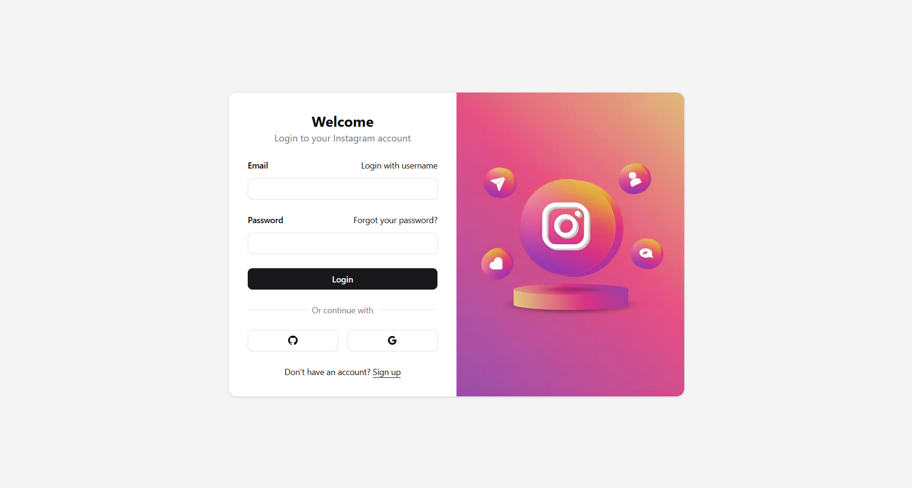

### Signup Page

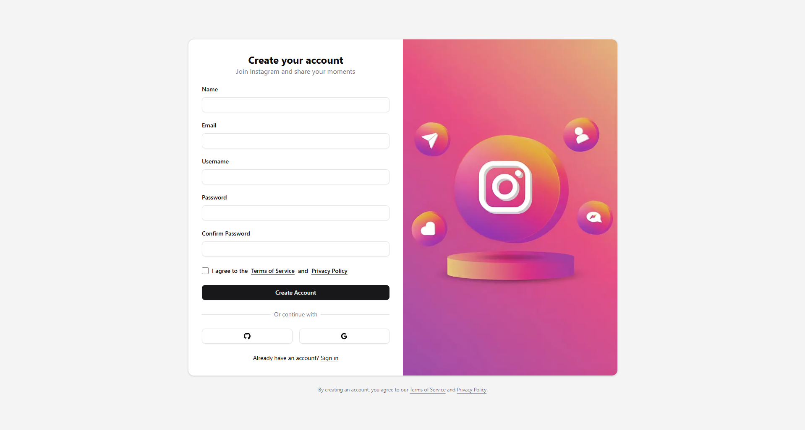

### Home Feed and Posts

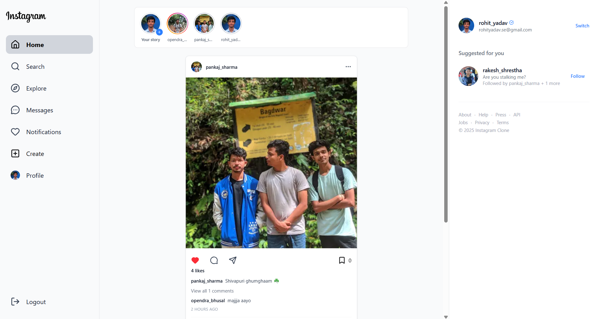

### Stories

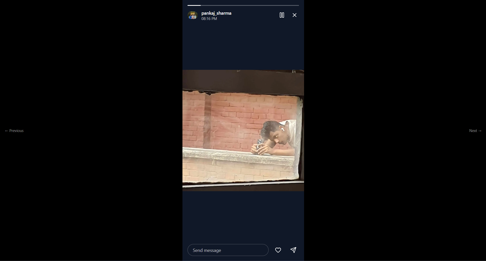

### Search

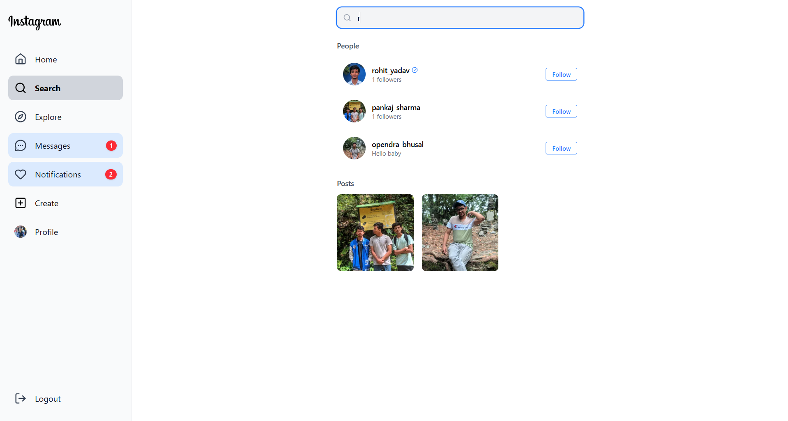

### Explore


### Chat

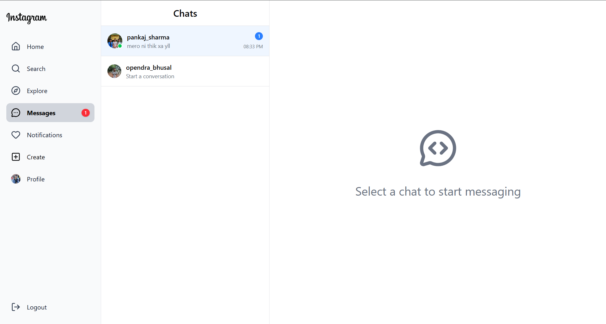
<hr>
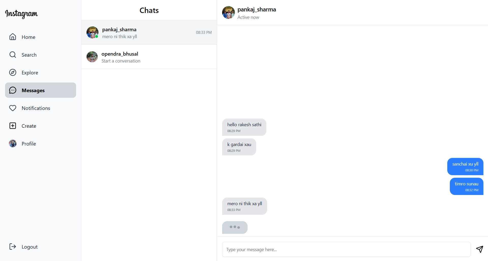

### Notifications

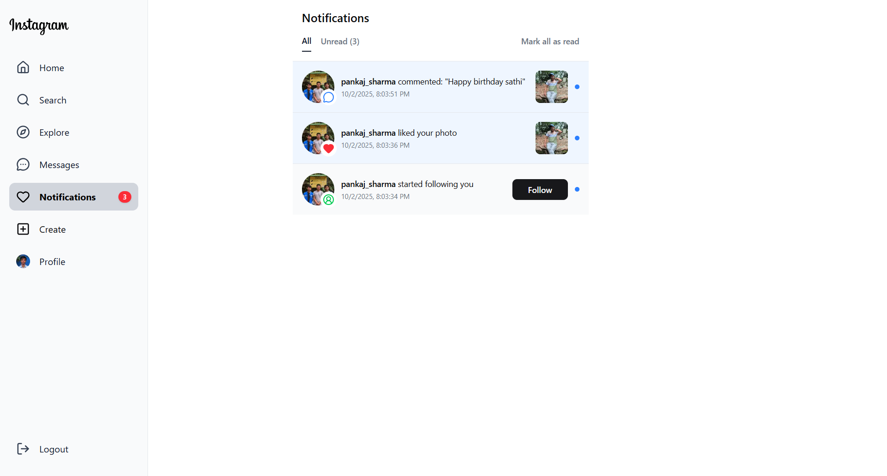

### Profile

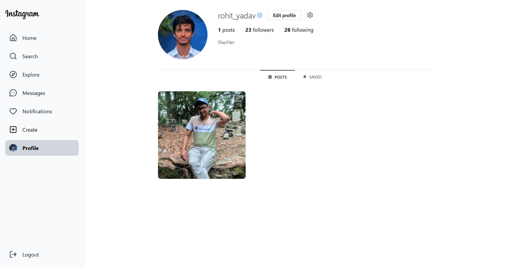

### Post Dialog

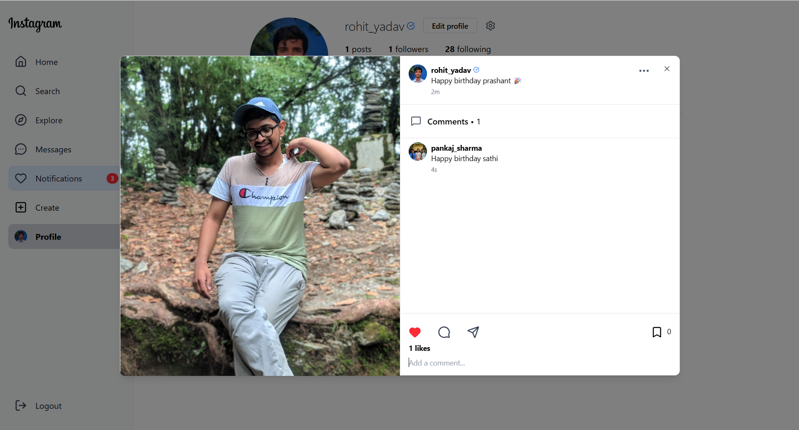

### Profile Edit

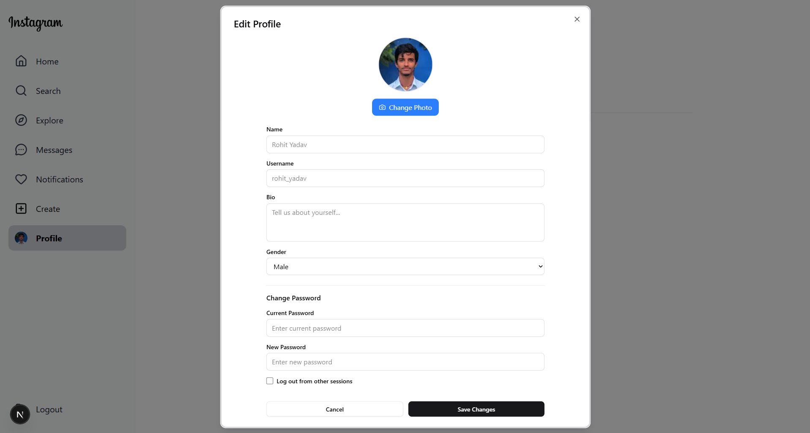

</div>

## 🚀 Features

- 🔐 **Authentication**

  - Email/Password login and registration
  - OAuth login (GitHub & Google)
  - Email verification
  - Password reset functionality
  - Account deletion with verification

- 📱 **Core Features**

  - Create, edit, and delete posts
  - Like and comment on posts
  - Bookmark posts
  - User profiles with bio and avatar
  - Follow/unfollow users
  - Real-time stories (24-hour expiration)
  - Explore feed for discovering new content
  - Search users

- 💬 **Real-time Messaging**

  - One-on-one chat
  - Real-time message delivery using Socket.IO
  - Message notifications

- 🔔 **Notifications**

  - Real-time notifications for likes, comments, and follows
  - Notification badge counter

- 👥 **Social Features**
  - User suggestions
  - Followers/Following lists
  - Block/unblock users
  - User profile pages

## 🛠️ Tech Stack

### Frontend

- **Framework**: Next.js 15.5 (App Router, Turbopack)
- **Language**: TypeScript
- **Styling**: Tailwind CSS
- **State Management**: Zustand
- **Data Fetching**: TanStack Query (React Query)
- **Authentication**: Better Auth
- **UI Components**: Radix UI
- **Animations**: Framer Motion
- **Real-time**: Socket.IO Client
- **HTTP Client**: Axios
- **Forms**: React Hook Form
- **Notifications**: React Hot Toast

### Backend

- **Runtime**: Node.js
- **Framework**: Express.js 5
- **Language**: TypeScript
- **Database**: MongoDB (Mongoose ORM)
- **Authentication**: Better Auth
- **Real-time**: Socket.IO
- **Image Upload**: Cloudinary
- **Email**: Nodemailer
- **Password Hashing**: bcrypt.js
- **Image Processing**: Sharp

## 📦 Project Structure

```
instagram-clone/
├── backend/                 # Backend server
│   ├── src/
│   │   ├── auth/           # Authentication setup
│   │   ├── config/         # Configuration files
│   │   ├── controllers/    # Request handlers
│   │   ├── middlewares/    # Custom middlewares
│   │   ├── models/         # Database models
│   │   ├── routes/         # API routes
│   │   ├── socket/         # Socket.IO setup
│   │   ├── utils/          # Utility functions
│   │   └── server.ts       # Entry point
│   ├── package.json
│   └── tsconfig.json
│
└── frontend/               # Next.js frontend
    ├── src/
    │   ├── app/           # Next.js app router pages
    │   ├── auth/          # Auth client setup
    │   ├── components/    # React components
    │   ├── config/        # Configuration files
    │   ├── hooks/         # Custom React hooks
    │   ├── lib/           # Utility libraries
    │   ├── store/         # Zustand store
    │   ├── types/         # TypeScript types
    ├── public/            # Static assets
    ├── package.json
    └── next.config.ts
```

## 🚀 Getting Started

### Prerequisites

- Node.js 18+ and npm
- MongoDB database
- Cloudinary account (for image uploads)
- GitHub OAuth App (optional, for GitHub login)
- Google OAuth App (optional, for Google login)

### Installation

1. **Clone the repository**

   ```bash
   cd instagram-clone
   ```

2. **Backend Setup**

   ```bash
   cd backend
   npm install
   ```

   Create a `.env` file in the `backend` directory:

   ```env
   PORT=5000

   FRONTEND_URL=http://localhost:3000

   BETTER_AUTH_URL=http://localhost:5000

   BETTER_AUTH_SECRET=your_secret_key_here

   MONGODB_URI=your_mongodb_connection_string

   CLOUDINARY_CLOUD_NAME=your_cloudinary_cloud_name

   CLOUDINARY_API_KEY=your_cloudinary_api_key

   CLOUDINARY_API_SECRET=your_cloudinary_api_secret

   GITHUB_CLIENT_ID=your_github_client_id

   GITHUB_CLIENT_SECRET=your_github_client_secret

   GOOGLE_APP_PASSWORD=your_google_app_password

   GOOGLE_CLIENT_ID=your_google_client_id

   GOOGLE_CLIENT_SECRET=your_google_client_secret
   ```

3. **Frontend Setup**

   ```bash
   cd ../frontend
   npm install
   ```

   Create a `.env.local` file in the `frontend` directory:

   ```env
   NEXT_PUBLIC_API_URL=http://localhost:5000

   NEXT_PUBLIC_FRONTEND_URL=http://localhost:3000

   BETTER_AUTH_SECRET=your_secret_key_here

   BETTER_AUTH_URL=http://localhost:3000
   ```

### Running the Application

1. **Start the Backend** (from the `backend` directory)

   ```bash
   # Development mode with auto-reload
   npm run build  # In one terminal
   npm run dev  # In another terminal
   ```

2. **Start the Frontend** (from the `frontend` directory)

   ```bash
   npm run dev
   ```

3. **Access the Application**

   - Frontend: http://localhost:3000

   - Backend API: http://localhost:5000

## 🔧 Configuration

### OAuth Setup

#### GitHub OAuth

1. Go to [GitHub Developer Settings](https://github.com/settings/developers)
2. Create a new OAuth App
3. Set Authorization callback URL to: `http://localhost:5000/api/auth/callback/github`
4. Add the Client ID and Client Secret to your `.env` file

#### Google OAuth

1. Go to [Google Cloud Console](https://console.cloud.google.com/)
2. Create a new project or select existing
3. Enable Google+ API
4. Create OAuth 2.0 credentials
5. Set Authorized redirect URIs to: `http://localhost:5000/api/auth/callback/google`
6. Add the Client ID and Client Secret to your `.env` file

### Cloudinary Setup

1. Sign up at [Cloudinary](https://cloudinary.com/)
2. Get your Cloud Name, API Key, and API Secret from the dashboard
3. Add them to your `.env` file

### MongoDB Setup

- Use [MongoDB Atlas](https://www.mongodb.com/cloud/atlas) for a cloud database
- Or install MongoDB locally
- Add your connection string to the `.env` file

## 🚢 Deployment

### Frontend (Vercel)

1. Push your code to GitHub
2. Import project in [Vercel](https://vercel.com)
3. Set Root Directory to `frontend`
4. Add environment variable: `NEXT_PUBLIC_API_URL` (your backend URL)
5. Deploy

### Backend (Railway/Render)

1. Create account on [Railway](https://railway.app) or [Render](https://render.com)
2. Create new project from GitHub repository
3. Set Root Directory to `backend`
4. Add all environment variables from `.env.example`
5. Deploy

> **Note**: Vercel is not recommended for the backend due to Socket.IO requirements. Use Railway, Render, or similar platforms that support WebSockets.

## 🤝 Contributing

Contributions are welcome! Please feel free to submit a Pull Request.

1. Fork the repository
2. Create your feature branch (`git checkout -b feature/AmazingFeature`)
3. Commit your changes (`git commit -m 'Add some AmazingFeature'`)
4. Push to the branch (`git push origin feature/AmazingFeature`)
5. Open a Pull Request

## 📄 License

This project is open source and available under the [MIT License](LICENSE).

## 👤 Author

**Shubham Tiwari**

## 🙏 Acknowledgments

- Inspired by Instagram
- Built with modern web technologies
- Icons from [Lucide](https://lucide.dev/)
- UI components from [Radix UI](https://www.radix-ui.com/)

<hr>

⭐ If you find this project helpful, please consider giving it a star!
